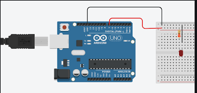

# BasicArduino
I'm going to learn how to use an Arduino, and make awesome things with it!


## TableofContents
* [TableOfContents](#TableOfContents)
* [HelloArduino](#HelloArduino)
* [FiniteLEDBlink](#FiniteLEDBlink)
* [VariableLEDBlink](#VariableLEDBlink)
* [OneButtonOneLED](#OneButtonOneLED)
* [TwoButtonTwoLED](#TwoButtonTwoLED)
* [Servo](#Servo)

## HelloArduino

### Description & Code

```C++

  /*
  Blink

  Turns an LED on for half a second, then off for half a second, repeatedly.
  
  modified 8 May 2014  by Scott Fitzgerald
 
  http://www.arduino.cc/en/Tutorial/Blink
*/


// the setup function runs once when you press reset or power the board
void setup() {
  // initialize digital pin 13 as an output.
  pinMode(13, OUTPUT);
  Serial.begin(9600); // This turns on my Serial Monitor
  Serial.print("Hello World!");
  Serial.print("1...");
  Serial.print("2...");
  Serial.print("3...");
}

// the loop function runs over and over again forever
void loop() {
  Serial.println("Blink!");

  digitalWrite(13, HIGH);           // turn the LED on (HIGH is the voltage level)
  delay(250);                       // wait for a second
  digitalWrite(13, LOW);            // turn the LED off by making the voltage LOW
  delay(250);                       // wait for a second
}

```

### Evidence
[Here is my code on Arduino Create](https://create.arduino.cc/editor/helmstk1/9a3831dd-4b86-42f2-be49-c28b84874092/preview)

### Image or Wiring


### Reflection

this was hard for me to figure out at first but then once I figured out what the parts of the code mean it made more sense. i realized that high meant on and low meant off and then you could use the void loop for the delay.


## FiniteLEDBlink

### Description & Code

```C++
int ledPin = 13;
int blinkTime = 500;

void setup()
{
  pinMode(ledPin, OUTPUT);
  blinkyBlinky(5, blinkTime); // 5 is number of blinks, blinkTime is the milliseconds in each state from above: int blinkTime = 500;
}

void loop()
{
  //
}

void blinkyBlinky(int repeats, int time)
{
  for (int i = 0; i < repeats; i++)
  {
    digitalWrite(ledPin, HIGH);
    delay(time);
    digitalWrite(ledPin, LOW);
    delay(time);
  }
}
```

### Evidence
[here is my code in arduino create] https://create.arduino.cc/editor/ljennin23/bc0252e0-3b0a-4cd7-9429-e219adb2909f 

### Image or Wiring


### Reflection
This assignment made me realise that I definitely like CAD better than arduio. I had a hard time figuring out this code so I went on google and looked on the arduino website https://forum.arduino.cc/index.php?topic=273575.0 and looked at some code there. This helped me figure out this code.


## VariableLEDBlink

### Description & Code

```C++
/* Karl Helmstetter
  variable LED BLink
  This should blink an LED faster and faster, until it reaches 5 blinks per second
*/

int ledPin = 8;
int delayVar = 1000;  //this variable is used for my delays.

void setup() {
  pinMode(ledPin, OUTPUT);
  Serial.begin(9600);
}

void loop() {
  Serial.println(delayVar);

  digitalWrite(ledPin, HIGH);           // turn the ledPin on (HIGH is the voltage level)
  delay(delayVar);                   // pause for (delayVar) milliseconds
  digitalWrite(ledPin, LOW);            // turn the ledPin off by making the voltage LOW
  delay(delayVar);                   // pause for (delayVar) milliseconds

if(delayVar > 100){
  delayVar = delayVar - 100;
}
  //
  //as long as the delay is longer than 100 ms, we should continue to blink,
  // and we should also reduce delayVar by 100 ms.
  // (this way, once delayVar hits 100, we stop reducing it.)

}
```


### Evidence
https://create.arduino.cc/editor/ljennin23/9015e9cc-f054-4798-8797-6e66fcd742d5


### Image or Wiring


### Reflection

I had trouble with this assignment and had to ask Mr. Helmstetter to help me. He gave me his code and looked over it to make sure everything made sense and it did. This code was very similar to the finite LED blink, and we had to do a if statement to make sure the blinkng gets as fast as possible. then I i figured it out.


## OneButtonOneLED

### Description & Code
In this assignment we were asked to make a Led light up by the pushing of a button on the arduino.  

Credit goes to [Dominick Cafferillo](https://github.com/dcaffer07/BasicArduino/blob/main/README.md) for the link

'''
 int buttonPin = 2; // Pin connected to PushButton                                                                       
int ledPin = 13; // Pin connected to LED
int buttonState = 0; // Gives pushbutton a value

void setup() {
  
  pinMode(ledPin, OUTPUT); // Led-> Output
  pinMode(buttonPin, INPUT); // Led-> Input
}

void loop() {
  buttonState = digitalRead(buttonPin); // Read the given input from pin 2
  if(buttonState == HIGH) { // If i push button, set to be  high
    digitalWrite(ledPin, HIGH); // LED on
  }
  else{
    digitalWrite(ledPin, LOW); // If not on-> Off
  }
  }
  '''


### Evidence
https://create.arduino.cc/editor/ljennin23/1cac2420-dfd6-4efe-aaec-c5c3a00d4573
 

### Image or Wiring


Credit goes to [Dominick Cafferillo](https://github.com/dcaffer07/BasicArduino/blob/main/README.md) for the link

### Reflection

This Assignment was very challenging, and i am still working of correcting the wiring. I understand Dominick's code well, the if statement in his code states when the  button is pushed the Led turns on. 


## TwoButtonTwoLED

### Description & Code
This was similar to the One button one LED except it was doubled.

void setup() {
  // LED pin as an output:
  pinMode(ledPin1, OUTPUT);
  // button pin as an input:
  pinMode(buttonPin1, INPUT_PULLUP);
  pinMode(ledPin2, OUTPUT);
  pinMode(buttonPin2, INPUT_PULLUP);
}

void loop() {
  // pushbutton value:
  buttonState = digitalRead(buttonPin1);

  // check if the pushbutton is pressed.
  // if it is, the buttonState is HIGH:
  if (buttonState == HIGH) {
    digitalWrite(ledPin1, LOW);
    delay(0);
    digitalWrite(ledPin1, HIGH);
    delay(0);
    digitalWrite(ledPin1, LOW);
  }

  // pushbutton value:
  buttonState = digitalRead(buttonPin2);

  // check if the pushbutton is pressed.
  // if it is, the buttonState is HIGH:
  if (buttonState == HIGH) {
    digitalWrite(ledPin2, LOW);
    delay(0);
    digitalWrite(ledPin2, HIGH);
    delay(0);
    digitalWrite(ledPin2, LOW);
  }
}
```
Credit goes to [Dominick Cafferillo](https://github.com/dcaffer07/BasicArduino/blob/main/README.md) for the link


### Evidence
https://create.arduino.cc/editor/ljennin23/ac4f94d6-f6f4-49c2-b5fd-40ef2ad9e401
 

### Image or Wiring
 
Credit goes to [Dominick Cafferillo](https://github.com/dcaffer07/BasicArduino/blob/main/README.md) for the link


### Reflection
This was just the same as the One button One LED except it was doubled. The code makes sense in the sense that you neede to create a button Pin 2 for the second button. This was relatively hard code to understand but overall makes sense.

## Servo

### Description & Code
In this assignment we were asked to make a servo turn one way when one button is pushed, and go the other way when the second button is pushed. This is similar to the two button two led but instead of Leds you have a servo.

 #include <Servo.h>

Servo myservo;  // my servo

int angle =180;    // start point for servo
int angleStep =180;

#define LEFT 12   // pin 12 is connected to left button
#define RIGHT  2  // pin 2 is connected to right button

void setup() {
  Serial.begin(9600);          //  setup
  myservo.attach(9);  // servo to pin 9
  pinMode(LEFT,INPUT_PULLUP); // button 1 to pin 12
  pinMode(RIGHT,INPUT_PULLUP);//  button 2 to pin 2
  myservo.write(angle);// send servo to the middle at 90 degrees
 Serial.println("My Servo Button ");
}

void loop() {
  while(digitalRead(RIGHT) == LOW){

    if (angle > 0 && angle <= 180) {
      angle = angle - angleStep;
       if(angle < 0){
        angle = 0;
       }else{
      myservo.write(angle); // move the servo to desired angle
      Serial.print("Moved to: ");
      Serial.print(angle);   // print the angle
      Serial.println(" degree");
       }
    }
    
  delay(100); // waits for the servo to get there
  }// while

  while(digitalRead(LEFT) == LOW){

    if (angle >= 0 && angle <= 180) {
      angle = angle + angleStep;
      if(angle >180){
        angle =180;
       }else{
      myservo.write(angle); // move the servo to the angle wanted
      Serial.print("Moved to: ");
      Serial.print(angle);   // print the angle
      Serial.println(" degree");
       }
    }
    
  delay(100); // waits for the servo to get there
  }// 

  
}
Credit goes to [Dominick Cafferillo](https://github.com/dcaffer07/BasicArduino/blob/main/README.md) for the link

### Evidence
https://create.arduino.cc/editor/ljennin23/39106641-522c-4079-a6a1-74ffe3ffd8f7
 
### Image or Wiring

Credit goes to [Dominick Cafferillo](https://github.com/dcaffer07/BasicArduino/blob/main/README.md) for the link

### Reflection
Tis code was more challenging to understand I had to look over it and use google to figure out what each line means. In the end I firgured it out even if this was challenging for me.
